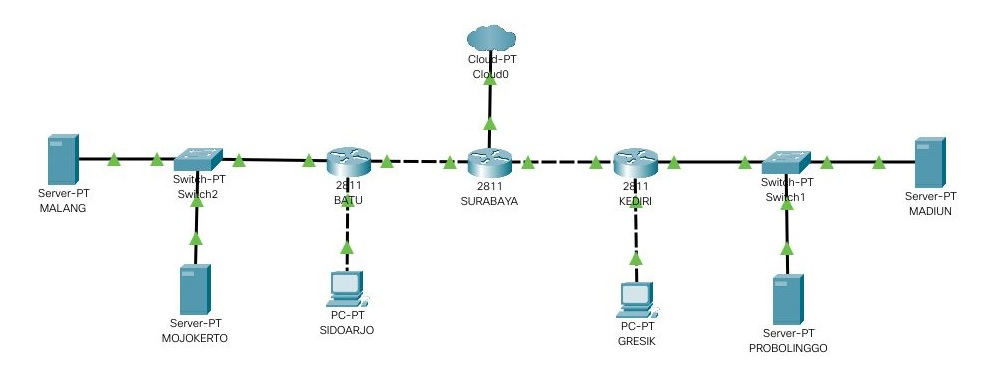
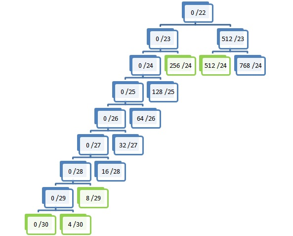

# Jarkom_Modul5_LaporanResmi_B01

Setelah kalian mempelajari semua modul yang telah diberikan, Bibah ingin meminta bantuan untuk terakhir kalinya kepada kalian. Dan kalian dengan senang hati mau membantu Bibah.

(A) Tugas pertama kalian yaitu membuat topologi jaringan sesuai dengan rancangan yang diberikan Bibah seperti dibawah ini :


 
Keterangan : 

SURABAYA diberikan IP TUNTAP 
MALANG merupakan DNS Server diberikan IP DMZ 
MOJOKERTO merupakan DHCP Server diberikan IP DMZ 
MADIUN dan PROBOLINGGO merupakan WEB Server 
Setiap Server diberikan memory sebesar 128M 
Client dan Router diberikan memori sebesar 96M 
Jumlah host pada subnet SIDOARJO 200 Host 
Jumlah host pada subnet GRESIK 210 Host

```
# Switch
uml_switch -unix switch1 > /dev/null < /dev/null &
uml_switch -unix switch2 > /dev/null < /dev/null &
uml_switch -unix switch3 > /dev/null < /dev/null &
uml_switch -unix switch4 > /dev/null < /dev/null &
uml_switch -unix switch5 > /dev/null < /dev/null &
uml_switch -unix switch6 > /dev/null < /dev/null &

# Router
xterm -T SURABAYA -e linux ubd0=SURABAYA,jarkom umid=SURABAYA eth0=tuntap,,,10.151.74.9 eth1=daemon,,,switch3 eth2=daemon,,,switch4 mem=96M &
xterm -T KEDIRI -e linux ubd0=KEDIRI,jarkom umid=KEDIRI eth0=daemon,,,switch3 eth1=daemon,,,switch1 eth2=daemon,,,switch5 mem=96M &
xterm -T BATU -e linux ubd0=BATU,jarkom umid=BATU eth0=daemon,,,switch4 eth1=daemon,,,switch2 eth2=daemon,,,switch6 mem=96M &

#Server
xterm -T MADIUN -e linux ubd0=MADIUN,jarkom umid=MADIUN eth0=daemon,,,switch1 mem=128M &
xterm -T PROBOLINGGO -e linux ubd0=PROBOLINGGO,jarkom umid=PROBOLINGGO eth0=daemon,,,switch1 mem=128M &
xterm -T MALANG -e linux ubd0=MALANG,jarkom umid=MALANG eth0=daemon,,,switch2 mem=128M &
xterm -T MOJOKERTO -e linux ubd0=MOJOKERTO,jarkom umid=MOJOKERTO eth0=daemon,,,switch2 mem=128M &

# Klien
xterm -T GRESIK -e linux ubd0=GRESIK,jarkom umid=GRESIK eth0=daemon,,,switch5 mem=96M &
xterm -T SIDORJO -e linux ubd0=SIDORJO,jarkom umid=SIDORJO eth0=daemon,,,switch6 mem=96M &
```

(B) karena kalian telah mempelajari Subnetting dan Routing, Bibah meminta kalian untuk membuat topologi tersebut menggunakan teknik CIDR atau VLSM.

Menggunakan VLSM


 
SURABAYA 
```
auto eth0
iface eth0 inet static
address 10.151.74.10
netmask 255.255.255.252
gateway 10.151.74.9

auto eth1	# kediri
iface eth1 inet static
address 192.168.0.5
netmask 255.255.255.252

auto eth2	# batu
iface eth2 inet static
address 192.168.0.1
netmask 255.255.255.252
```

KEDIRI
```
auto eth0	# surabaya
iface eth0 inet static
address 192.168.0.6
netmask 255.255.255.252
gateway 192.168.0.5# server

auto eth1	# server
iface eth1 inet static
address 192.168.0.9
netmask 255.255.255.248

auto eth2	 # gresik
iface eth2 inet static
address 192.168.2.1
netmask 255.255.255.0
```

MADIUN
```
auto eth0
iface eth0 inet static
address 192.168.0.10
netmask 255.255.255.248
gateway 192.168.0.9
```

PROBOLINGGO 
```
auto eth0
iface eth0 inet static
address 192.168.0.11
netmask 255.255.255.248
gateway 192.168.0.9
```

GRESIK
```
auto eth0
iface eth0 inet static
address 192.168.2.2
netmask 255.255.252.0
gateway 192.168.2.1
```

BATU 
```
auto eth0
iface eth0 inet static
address 192.168.0.2
netmask 255.255.255.252
gateway 192.168.0.1

auto eth1
iface eth1 inet static
address 10.151.83.17
netmask 255.255.255.248

auto eth2
iface eth2 inet static
address 192.168.1.1
netmask 255.255.255.0
```

MALANG
```
auto eth0
iface eth0 inet static
address 10.151.83.18
netmask 255.255.255.248
gateway 10.151.83.17
```

MOJOKERTO
```
auto eth0
iface eth0 inet static
address 10.151.83.19
netmask 255.255.255.248
gateway 10.151.83.17
```

SIDORJO
```
auto eth0
iface eth0 inet static
address 192.168.1.2
netmask 255.255.255.0
gateway 192.168.1.1
```


(C) Kalian juga diharuskan melakukan routing agar setiap perangkat pada jaringan tersebut dapat terhubung.

SURABAYA
```
route add -net 192.168.1.0 netmask 255.255.255.0 gw 192.168.0.2
route add -net 192.168.2.0 netmask 255.255.255.0 gw 192.168.0.6
route add -net 10.151.83.16 netmask 255.255.255.248 gw 192.168.0.2
route add -net 192.168.0.8 netmask 255.255.255.248 gw 192.168.0.6
```

KEDIRI
```
route add -net 0.0.0.0 netmask 0.0.0.0 gw 192.168.0.5
```

BATU 
```
route add -net 0.0.0.0 netmask 0.0.0.0 gw 192.168.0.1
```

(D) Tugas berikutnya adalah memberikan ip pada subnet SIDOARJO dan GRESIK secara dinamis menggunakan bantuan DHCP SERVER (Selain subnet tersebut menggunakan ip static). Kemudian kalian mengingat bahwa kalian harus setting DHCP RELAY pada router yang menghubungkannya.

MOJOKERTO
```
apt-get install isc-dhcp-server
```
```
nano /etc/default/isc-dhcp-server
INTERFACES="eth0"
```
```
nano /etc/dhcp/dhcpd.conf
```
```
subnet 10.151.83.16 netmask 255.255.255.248 {
}

subnet 192.168.2.0 netmask 255.255.255.0 {
    range 192.168.2.2 192.168.2.212;
    option routers 192.168.2.1;
    option broadcast-address 192.168.2.255;
    option domain-name-servers 10.151.83.16;
    default-lease-time 600;
    max-lease-time 7200;
}

subnet 192.168.1.0 netmask 255.255.255.0 {
    range 192.168.1.2 192.168.1.202;
    option routers 192.168.1.1;
    option broadcast-address 192.168.1.255;
    option domain-name-servers 10.151.83.16;
    default-lease-time 600;
    max-lease-time 7200;
}
```
```
service isc-dhcp-server restart
```

KEDIRI
install dhcp relay
```
apt-get install isc-dhcp-relay
```
```
service isc-dhcp-relay restart
```

BATU
```
install dhcp relay
```
```
apt-get install isc-dhcp-relay
```
```
service isc-dhcp-relay restart
```

1. Agar topologi yang kalian buat dapat mengakses keluar, kalian diminta untuk mengkonfigurasi
SURABAYA menggunakan iptables, namun Bibah tidak ingin kalian menggunakan
MASQUERADE.

SURABAYA
```
iptables -t nat -A POSTROUTING -s 192.168.0.0/16 -o eth0 -j SNAT --to-source 10.151.74.10
```

2. Kalian diminta untuk mendrop semua akses SSH dari luar Topologi (UML) Kalian pada server
yang memiliki ip DMZ (DHCP dan DNS SERVER) pada SURABAYA demi menjaga keamanan.

SURABAYA
```
iptables -A FORWARD -d 10.151.83.16/29 -i eth0 -p tcp --dport 22 -j DROP
```

3. Karena tim kalian maksimal terdiri dari 3 orang, Bibah meminta kalian untuk membatasi DHCP
dan DNS server hanya boleh menerima maksimal 3 koneksi ICMP secara bersamaan yang berasal dari
mana saja menggunakan iptables pada masing masing server, selebihnya akan di DROP.

SURABAYA, MALANG, MOJOKERTO
```
iptables -A INPUT -p icmp -m connlimit --connlimit-above 3 --connlimit-mask 0 -j LOGGING
```

4. Akses dari subnet SIDOARJO hanya diperbolehkan pada pukul 07.00 - 17.00 pada hari Senin
sampai Jumat.

MALANG
```
iptables -A INPUT -s 192.168.1.0/24 -m time --timestart 07:00 --timestop 17:00 --weekdays
Mon,Tue,Wed,Thu,Fri -j ACCEPT
```

5. Akses dari subnet GRESIK hanya diperbolehkan pada pukul 17.00 hingga pukul 07.00 setiap
harinya.

MALANG
```
iptables -A INPUT -s 192.168.2.0/24 -m time --timestart 17:00 --timestop 00:00 -j ACCEPT
iptables -A INPUT -s 192.168.2.0/24 -m time --timestart 00:00 --timestop 07:00 -j ACCEPT
```

6. Bibah ingin SURABAYA disetting sehingga setiap request dari client yang mengakses DNS Server akan didistribusikan secara bergantian pada PROBOLINGGO port 80 dan MADIUN port 80.

SURABAYA

Probolinggo: 
```
iptables -A PREROUTING -t nat -p tcp -d 10.151.83.18 -m statistic --mode nth --every 2 --packet 0 -j DNAT --to-destination 192.168.0.11:80
```
Madiun: 
```
iptables -A PREROUTING -t nat -p tcp -d 10.151.83.18 -j DNAT --to-destination 192.168.0.10:80
```

7. Bibah ingin agar semua paket didrop oleh firewall (dalam topologi) tercatat dalam log pada setiap
UML yang memiliki aturan drop.

SURABAYA, MALANG, MOJOKERTO
```
iptables -N LOGGING
iptables -A INPUT -p icmp -m connlimit --connlimit-above 3 --connlimit-mask 0 -j LOGGING #no3
iptables -A LOGGING -m limit --limit 2/min -j LOG --log-prefix "DROP: " --log-level info
iptables -A LOGGING -j DROP
```
